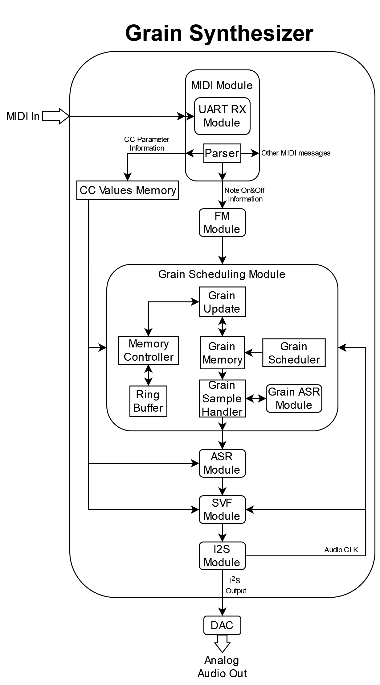

# FPGA Implementation of a Real-time Synthetic-Based Granular Synthesizer
This repo contains the source code backup of the thesis. The topic of the thesis is "FPGA Implementation of a Real-time Synthetic-Based Granular Synthesizer".
A diagram of the implementation is shown below.

The final binary is given as BOOT.bin.

## VHDL Source Files
The VHDL project was not backed up, only its source files. These files are available in the vhdl_src folder.

## PCB Files
The KiCad files for a breakout board developed for the Z-turn board V2 are given in the Breakout folder.

## MATLAB Source Files
MATLAB source files are given in the matlab_src.

## Extras
Some extra files are contained in the misc_src folder. Some of these are scripts used to generate plots for the thesis, there are some exploratory scripts towards pitch_shifting that was future work for the thesis and finally there is a C script used to generate code for the MIDI_LUT.
